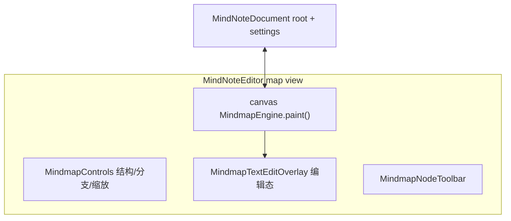
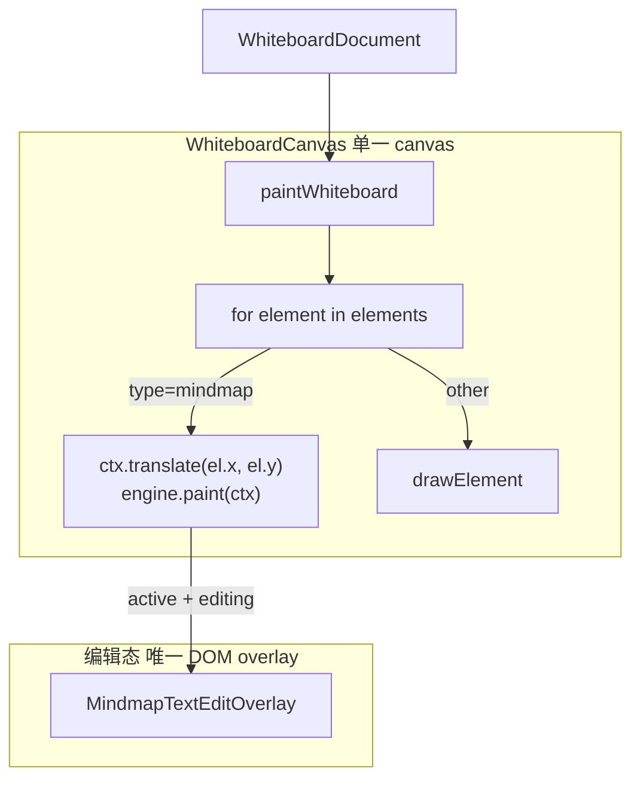

# 自研思维导图引擎 — 技术方案

> **版本**：v1.1  
> **日期**：2026-07-07  
> **状态**：方案设计  
> **关联文档**：[whiteboard-architecture.md](./whiteboard-architecture.md)、[自研表格系统-技术方案设计.md](./自研表格系统-技术方案设计.md)

---

## 结论先行

| 维度 | 现状（simple-mind-map） | 自研方案 |
|------|-------------------------|----------|
| 渲染 | DOM/SVG 第三方库，画板需 DOM overlay | **统一 Canvas 2D 引擎**，布局/绘制/hit test 同源 |
| 画板集成 | `WbMindmapCanvasLayer` + `translateXY` 对齐 hack | **原生 WhiteboardElement**，与形状/文本同一渲染管线 |
| 独立文档 | `MindNoteMapView` 与画板引擎 **重复 ~500 行** | **同一 `@lingyi-doc/mind-map` 库**，`mode: standalone \| embedded` |
| 坐标系 | SMM 内部坐标 vs core `computeMindMapLayout` **双轨** | **单一 `MindmapLayoutSnapshot`** 驱动绘制与交互 |
| 依赖 | `simple-mind-map@0.14` + CSS | **零第三方导图依赖**，仅 Canvas + 可选 React 壳 |
| 导出/截图 | 无法与画板 Canvas 合成 | **同一 Canvas 上下文**，支持整板导出 |

**核心定位**：思维导图作为 **独立 npm 包**（`@lingyi-doc/mind-map`），基于 **自研 Canvas 引擎** 实现布局、渲染与交互；既可作为思维笔记文档的主视图独立运行，也可作为画板 `MindmapElement` 无缝嵌入，与现有 `MindNode` 数据模型和 `WhiteboardDocument` 协同体系对齐。

---

## 1. 背景与问题

### 1.1 当前架构

```mermaid
flowchart TB
  subgraph mindnote [思维笔记 docType=mindnote]
    MNV[MindNoteMapView]
    MNV --> WME1[WbMindMapEngine]
  end

  subgraph whiteboard [画板 docType=whiteboard]
    WCL[WbMindmapCanvasLayer DOM overlay]
    WCL --> WMV[WbMindmapView]
    WMV --> WME2[WbMindMapEngine]
    WC[WhiteboardCanvas canvas]
    WC -->|skip mindmap| PAINT[paintWhiteboard]
    WCL -->|z-index 10000+| PAINT
  end

  WME1 --> SMM[simple-mind-map SVG/DOM]
  WME2 --> SMM
  SMM --> ADAPT[smmAdapter MindNode ↔ SMM]
  ADAPT --> CORE[@lingyi-doc/core MindNode]

  CORE --> LAYOUT[computeMindMapLayout 仅 hit test / 尺寸估算]
  WME2 --> SYNC[syncMindmapBounds alignSmmEmbeddedView rAF×24]
```

### 1.2 simple-mind-map 集成问题清单

| # | 问题 | 代码证据 | 影响 |
|---|------|----------|------|
| P1 | **双布局引擎** | SMM 内部布局 vs `core/mindnote/layout.ts` | 选中框偏移、工具栏定位不准 |
| P2 | **嵌入对齐脆弱** | `syncMindmapBounds.ts`：`resetSmmEmbeddedView`、`alignSmmEmbeddedView`、rAF 最多 24 次重试、`SMM_EMBED_PADDING=64` | 画板内导图漂移、闪烁、边界同步失败 |
| P3 | **渲染分裂** | `paintWhiteboard.ts` L40：`if (el.type === 'mindmap') continue` | 缩放性能差、无法整板截图、pointer-events 分层复杂 |
| P4 | **代码重复** | `MindNoteMapView.tsx` ≈ `WbMindMapEngine.tsx` 各 ~400 行 | 维护成本高、行为不一致 |
| P5 | **自研 Canvas 未接入** | `drawMindmap.ts` 已实现 `drawMindmapElement`，**零引用** | 迁移路径不清晰 |
| P6 | **导出/复制排除 mindmap** | `copySelectionImage.ts` 跳过 `type==='mindmap'` | 无法复制/导出含导图的画板区域 |
| P7 | **Undo 冲突** | SMM 内部 history 被拦截，但 `data_change` 仍双向同步 | 与 `WhiteboardDocument` / `MindNoteDocument` history 打架 |
| P8 | **类型黑盒** | `type MindMapInstance = any`，直接访问 `mm.renderer.textEdit` | 升级 SMM 版本风险高 |
| P9 | **死代码** | `WbMindmapCanvasOverlay.tsx`、`WhiteboardMindmapCanvasItem.tsx` 无引用 | 架构混乱 |

### 1.3 迁移目标

1. **移除** 画板与思维笔记对 `simple-mind-map` 的运行时依赖  
2. **保留** 现有 `MindNode` / `MindNoteJSON` / `MindmapElement` JSON 结构（兼容存量文档）  
3. **统一** 布局、绘制、命中测试到同一引擎  
4. **包边界清晰**：`@lingyi-doc/mind-map` 可单独发布、单独 Storybook 演示  
5. **双模式**：`standalone`（思维笔记）与 `embedded`（画板元素）共用同一引擎实例 API

---

## 2. 总体架构

```mermaid
flowchart TB
  subgraph hosts [宿主应用]
    MNP[MindNoteEditorPage]
    WBP[WhiteboardEditorPage]
  end

  subgraph react [packages/lingyi-doc-mind-map-react]
    MV[MindmapView]
    MT[MindmapNodeToolbar]
    MC[MindmapControls]
    TEO[MindmapTextEditOverlay]
  end

  subgraph engine [packages/lingyi-doc-mind-map 无 React 依赖]
    ME[MindmapEngine]
    LE[LayoutEngine]
    CR[CanvasRenderer]
    IC[InteractionController]
    TM[TextMeasurer]
    TR[ThemeRegistry]
    HT[HitTest]
    ME --> LE
    ME --> CR
    ME --> IC
    LE --> TM
    CR --> TR
    IC --> HT
  end

  subgraph core [@lingyi-doc/core 数据层]
    MN[MindNode / MindNoteDocument]
    MME[MindmapElement / WhiteboardDocument]
  end

  MNP --> MV
  WBP --> MV
  MV --> ME
  MV --> TEO
  ME --> MN
  ME --> MME
```

### 2.1 Monorepo 包划分

| 包 | 职责 | 依赖 |
|----|------|------|
| `@lingyi-doc/mind-map` | Canvas 引擎：布局、渲染、交互、导出 | 无 React |
| `@lingyi-doc/mind-map-react` | React 组件：`MindmapView`、工具栏、文本编辑 overlay | `@lingyi-doc/mind-map`, React |
| `@lingyi-doc/core` | `MindNode` 类型、`MindNoteDocument`、画板 `MindmapElement` | 不变；layout 逐步 re-export 自 mindmap |
| `@lingyi-doc/editor` | 思维笔记/画板页面集成 | 消费 `@lingyi-doc/mind-map-react`，删除 `smm/` |

### 2.2 包内目录结构（建议）

```
packages/lingyi-doc-mind-map/
├── src/
│   ├── engine/
│   │   ├── MindmapEngine.ts          # 门面：layout + paint + hitTest + exec
│   │   ├── InteractionController.ts  # 指针/键盘路由
│   │   └── EmbeddedHostAdapter.ts    # 画板宿主契约
│   ├── layout/
│   │   ├── LayoutEngine.ts           # 从 core/mindnote/layout.ts 迁入
│   │   ├── structures/               # right/balanced/vertical/tree/timeline
│   │   └── types.ts                  # MindmapLayoutSnapshot
│   ├── renderer/
│   │   ├── CanvasRenderer.ts         # 从 drawMindmap.ts 演进
│   │   ├── drawEdge.ts
│   │   ├── drawNode.ts
│   │   └── drawSelection.ts
│   ├── measure/
│   │   ├── TextMeasurer.ts
│   │   └── CanvasTextMeasurer.ts
│   ├── hit/
│   │   └── hitTest.ts
│   ├── theme/
│   │   ├── ThemeRegistry.ts
│   │   └── presets.ts                # default / whiteboard / print
│   ├── commands/
│   │   ├── MindmapCommand.ts
│   │   └── applyCommand.ts           # 树 CRUD，复用 core/mindnote/tree.ts
│   ├── export/
│   │   └── exportPNG.ts
│   └── index.ts
├── package.json
└── tsconfig.json

packages/lingyi-doc-mind-map-react/
├── src/
│   ├── MindmapView.tsx               # 统一 standalone + embedded
│   ├── MindmapNodeToolbar.tsx
│   ├── MindmapControls.tsx
│   ├── MindmapTextEditOverlay.tsx
│   └── index.ts
└── package.json
```

---

## 3. 数据模型

### 3.1 节点树 `MindNode`（已有，不 breaking）

继续使用 `@lingyi-doc/core` 中的 `MindNode`：

```typescript
interface MindNode {
  id: string;
  text: string;
  completed?, collapsed?, bold?, italic?, underline?, color?, note?;
  image?, imageWidth?, imageHeight?;
  headingLevel?: 1 | 2 | 3;
  shapeKind?: 'text' | 'roundRect' | 'ellipse' | 'rect';
  fillColor?, borderColor?, textBgColor?, fontSize?;
  fillOpacity?, borderOpacity?;
  children: MindNode[];
}
```

**JSON 存储不变**：思维笔记 `MindNoteJSON.root`、画板 `MindmapElement.root` 无需迁移。

### 3.2 渲染配置 `MindmapRenderConfig`

```typescript
interface MindmapRenderConfig {
  structure: MindNoteStructure;      // right | left | balanced | vertical | tree* | timeline*
  branchStyle: MindNoteBranchStyle;  // curve | straight
  theme: MindmapThemeId | MindmapTheme;
  padding: number;                   // standalone 48，embedded 16
  devicePixelRatio: number;
}
```

### 3.3 布局快照 `MindmapLayoutSnapshot`（引擎唯一产出）

```typescript
interface MindmapLayoutSnapshot {
  bounds: { x: number; y: number; width: number; height: number };
  nodes: LayoutNode[];   // id, x, y, width, height, depth, side, lines[], collapseHandle?
  edges: LayoutEdge[];   // fromId, toId, path: Path2D | string
  nodeIndex: Map<string, LayoutNode>;
  version: number;
}
```

**铁律**：绘制、hit test、选区框、工具栏定位、尺寸回写 **只读** `MindmapLayoutSnapshot`，禁止第二套布局。

---

## 4. Canvas 引擎设计

### 4.1 设计目标

| 指标 | 目标 |
|------|------|
| 节点规模 | 单图 ≤ 2000 节点流畅交互 |
| 滚动/缩放 | 60fps（脏区重绘） |
| 首屏 | < 300ms（500 节点） |
| 嵌入画板 | 零 DOM overlay（编辑态除外），纯 Canvas 元素 |
| 文本编辑 | Canvas 显示 + HTML contenteditable overlay（编辑态单实例） |
| 导出 | `toDataURL` / 并入画板整板 bitmap |

### 4.2 引擎核心 API

```typescript
/** 无 DOM 依赖的核心引擎 */
class MindmapEngine {
  constructor(options: MindmapEngineOptions);

  // ── 数据 ──
  setRoot(root: MindNode): void;
  getRoot(): MindNode;
  setConfig(config: Partial<MindmapRenderConfig>): void;

  // ── 视口（standalone 使用；embedded 固定 zoom=1）──
  setViewport(viewport: MindmapViewport): void;
  getViewport(): MindmapViewport;

  // ── 布局 ──
  layout(force?: boolean): MindmapLayoutSnapshot;
  getLayout(): MindmapLayoutSnapshot | null;

  // ── 渲染 ──
  paint(ctx: CanvasRenderingContext2D, dirtyRect?: Rect): void;

  // ── 交互 ──
  hitTest(localX: number, localY: number): MindmapHitResult;
  getNodeBounds(nodeId: string): Rect | null;
  getContentBounds(): Size;

  // ── 命令 ──
  exec(command: MindmapCommand): MindmapCommandResult;

  // ── 事件 ──
  on(event: MindmapEvent, handler: Handler): Unsubscribe;
}

interface MindmapEngineOptions {
  mode: 'standalone' | 'embedded';
  root: MindNode;
  config: MindmapRenderConfig;
  hostAdapter?: EmbeddedHostAdapter;  // embedded 必填
  measureText?: TextMeasurer;
}

type MindmapEvent =
  | 'layout:change'      // 布局快照更新
  | 'selection:change'   // activeNodeId 变化
  | 'edit:start' | 'edit:commit' | 'edit:cancel'
  | 'root:change'        // 树数据变更，宿主应写回 document
  | 'bounds:change';     // embedded：内容尺寸变化

type MindmapCommand =
  | { type: 'select'; nodeId: string | null }
  | { type: 'insertChild'; nodeId: string }
  | { type: 'insertSibling'; nodeId: string }
  | { type: 'insertParent'; nodeId: string }
  | { type: 'delete'; nodeId: string }
  | { type: 'toggleCollapse'; nodeId: string }
  | { type: 'updateNode'; nodeId: string; patch: Partial<MindNode> }
  | { type: 'moveNode'; nodeId: string; newParentId: string; index: number };  // P2
```

### 4.3 渲染分层（同一 Canvas，分 pass 绘制）

```
Pass 0  Background       背景色 / 点阵（standalone）
Pass 1  Edges             连接线（curve / straight / bracket / timeline）
Pass 2  NodeBodies         形状填充 + 边框
Pass 3  NodeContent        文字、图片、完成态图标
Pass 4  CollapseHandles     折叠/展开按钮
Pass 5  Selection           选区、hover、编辑高亮
Pass 6  DragPreview          拖拽幽灵（P2）
```

**脏区策略**：

- 文本变更 → 重算子树 layout → 标记子树 bbox union  
- 视口平移 → 仅 `ctx.setTransform`，不重新 layout  
- 折叠/展开 → 子树 layout + 相邻子树 reflow  

**已有代码复用**：`packages/lingyi-doc-editor/src/whiteboard/canvas/drawMindmap.ts` 的节点/连线绘制逻辑作为 `CanvasRenderer` 初版；`nodeStyle.ts` 的 `resolveNodeAppearance` 迁入 theme 层。

### 4.4 文本测量

```typescript
interface TextMeasurer {
  measureWidth(text: string, font: string): number;
  wrapLines(text: string, maxWidth: number, font: string): string[];
}
```

布局阶段统一走 `TextMeasurer`。浏览器环境用离屏 canvas `measureText`；Node/Worker 可用字符宽度 lookup（允许 ±1px 误差）。

现有 `core/mindnote/layout.ts` 已内置 canvas measure + SSR fallback，直接迁入。

### 4.5 布局引擎

**演进路径**：以 `packages/lingyi-doc-core/src/mindnote/layout.ts` 为基础迁入，补齐：

| 结构 | 算法 |
|------|------|
| `right` / `left` / `balanced` | 经典 mind map：子树高度堆叠 + 水平间距 |
| `vertical` / `treeRight` / `treeLeft` / `treeBalanced` | 括号/树形：缩进 + 竖向 spine |
| `timelineH` / `timelineV` | 时间轴：主轴 + 交替分支 |

**折叠**：布局时跳过 `collapsed` 子树，保留 collapse handle 占位。  
**图片**：读取 `imageWidth/Height` 纳入节点 bbox。

### 4.6 文本编辑策略

Canvas 不适合 IME 输入，采用 **显示/编辑分离**：

```
显示态：Canvas Pass 3 绘制文字
编辑态：MindmapTextEditOverlay（单个 contenteditable div）
         定位 = LayoutNode.screenRect + viewport transform
         提交 → engine.exec({ type:'updateNode', ... }) → root:change
         取消 → edit:cancel
```

- standalone / embedded **共用同一 overlay 组件**  
- embedded 仅在 `mindmapEditElementId === element.id` 时挂载  
- 编辑期间 Canvas 对应节点文字可隐藏或半透明，避免重影

---

## 5. 双运行模式

### 5.1 Standalone（思维笔记 · 导图视图）



- 引擎自持 `viewport: { x, y, zoom }`  
- 背景、fit-to-view、小地图由 standalone 壳提供  
- 与 `MindNoteDocument` 双向绑定：`root` + `settings.structure/branchStyle/zoom`  
- **替换**：`MindNoteMapView` → `MindmapView mode="standalone"`

### 5.2 Embedded（画板 · MindmapElement）



**关键变化**：

1. **删除** `WbMindmapCanvasLayer`、`WbMindMapEngine`、`syncMindmapBounds`  
2. `paintWhiteboard` **不再 skip mindmap**，调用 `drawMindmapElement` → `MindmapEngine.paint`  
3. `MindmapElement.width/height` 由 `layout().bounds + padding` 自动回写  
4. `mindmapHitTest.ts` 改为 `engine.hitTest(localX, localY)`  
5. 滚轮缩放 / 空白拖拽 **全部交给画板 viewport**，引擎 `zoom=1`

### 5.3 EmbeddedHostAdapter 契约

```typescript
interface EmbeddedHostAdapter {
  /** 引擎局部坐标 → 画板世界坐标 */
  localToWorld(x: number, y: number): Point;
  /** 画板世界坐标 → 引擎局部坐标 */
  worldToLocal(x: number, y: number): Point;
  /** 元素是否可交互（active 且未 locked） */
  isInteractive(): boolean;
  /** 内容 bounds 变化 → 更新 MindmapElement.width/height */
  onBoundsChange(size: { width: number; height: number }): void;
  /** 树变更 → WhiteboardDocument history */
  onRootChange(root: MindNode, recordHistory?: boolean): void;
  /** 请求进入/退出元素编辑态 */
  requestEditMode(active: boolean): void;
}
```

### 5.4 模式对比

| 能力 | standalone | embedded |
|------|------------|----------|
| 视口 pan/zoom | 引擎内部 | 画板 viewport × 元素 transform |
| 背景 | 有（可配置） | 透明 |
| 元素拖拽 | N/A | 画板统一处理（拖整个 MindmapElement） |
| 节点拖拽 | P2 | 不支持（避免与元素拖拽冲突） |
| resize 手柄 | N/A | 随内容 auto-size（P2 可选手动 resize） |
| undo 栈 | MindNoteDocument | WhiteboardDocument |
| 主题字号 | 大（root 28px） | 小（root 16px，`whiteboard` preset） |
| DOM 层 | canvas + 编辑 overlay | **无 overlay 层**，仅编辑态 overlay |

---

## 6. React 封装（@lingyi-doc/mind-map-react）

### 6.1 MindmapView

```typescript
export interface MindmapViewProps {
  root: MindNode;
  config: MindmapRenderConfig;
  mode: 'standalone' | 'embedded';

  readOnly?: boolean;
  activeNodeId?: string | null;
  editingNodeId?: string | null;

  /** standalone */
  viewport?: MindmapViewport;
  onViewportChange?: (vp: MindmapViewport) => void;

  /** embedded */
  hostAdapter?: EmbeddedHostAdapter;
  elementTransform?: { x: number; y: number };  // MindmapElement.x/y

  onRootChange: (root: MindNode, recordHistory?: boolean) => void;
  onSelectNode?: (id: string | null) => void;
  onReady?: (api: MindmapViewApi) => void;
}

export interface MindmapViewApi {
  engine: MindmapEngine;
  fitView(): void;
  focusNode(id: string): void;
  startEdit(id: string): void;
  exportPNG(scale?: number): Promise<Blob>;
}
```

### 6.2 组件迁移对照

| 现有（删除/合并） | 迁移后 |
|-------------------|--------|
| `MindNoteMapView` | `MindmapView mode="standalone"` |
| `WbMindMapEngine` + `WbMindmapView` | 删除；画板 `engine.paint` |
| `WbMindmapCanvasLayer` | 删除 |
| `WbMindmapToolbar` + `MindNoteMapNodeToolbar` | `MindmapNodeToolbar` |
| `smmAdapter.ts` | 删除；保留 `importFromSmmJson()` 一次性迁移工具 |
| `syncMindmapBounds.ts` | 删除 |
| `wbMindmapTheme.ts` / `simpleMindMapTheme.ts` | `ThemeRegistry.presets` |

---

## 7. 与画板集成细节

### 7.1 元素生命周期

```
createMindmapElement(layout, x, y)
  → elements.push({ type:'mindmap', root, layout, width, height })
  → engine.setRoot(root); engine.layout()
  → onBoundsChange → 回写 width/height
  → 可选：mindmapEditElementId = id

用户编辑节点
  → MindmapTextEditOverlay commit
  → onRootChange(root, true)
  → WhiteboardDocument.pushHistory
  → engine.setRoot(root) → layout → paint

paintWhiteboard
  → for mindmap: ctx.save(); ctx.translate(el.x, el.y); engine.paint(ctx); ctx.restore()
```

### 7.2 Hit Test 统一

```typescript
function hitWhiteboard(canvasX: number, canvasY: number): HitResult {
  for (const el of elementsByZDesc) {
    if (el.type === 'mindmap') {
      const local = worldToElementLocal(el, canvasX, canvasY);
      if (local.x < 0 || local.y < 0 || local.x > el.width || local.y > el.height) continue;
      const hit = engines.get(el.id)?.hitTest(local.x, local.y);
      if (hit.kind !== 'none') return { element: el, mindmapHit: hit };
    }
    // shape / text / ...
  }
}
```

### 7.3 协同与存储

- JSON 不变：`MindmapElement.root` 仍为 `MindNode` 树  
- Patch：复用 whiteboard diff；节点文本变更 → 更新 `root` 子树  
- CRDT：P1 与 whiteboard 一致（整元素 snapshot）；P2 可细化到节点级 OT

---

## 8. 功能对标（SMM → 自研）

| 功能 | SMM 现状 | 自研 P0 | 自研 P1 | 自研 P2 |
|------|----------|---------|---------|---------|
| 10 种结构布局 | ✅ | ✅ | ✅ | ✅ |
| 曲线/直线分支 | ✅ | ✅ | ✅ | ✅ |
| 节点折叠 | ✅ | ✅ | ✅ | ✅ |
| 节点样式（颜色/形状/字号） | ✅ | ✅ | ✅ | ✅ |
| 图片节点 | ✅ | ✅ | ✅ | ✅ |
| 快捷键 Tab/Enter/Delete | ✅ | ✅ | ✅ | ✅ |
| 缩放/平移（standalone） | ✅ | ✅ | ✅ | ✅ |
| 主题切换 | ✅ | ✅ | ✅ | ✅ |
| 节点拖拽排序 | ✅ | ❌ | ❌ | ✅ |
| 导出 PNG | ✅ | ✅ | ✅ | ✅ |
| 导出 SVG | 部分 | ❌ | ❌ | ✅ |
| 画板嵌入无漂移 | ❌ | ✅ | ✅ | ✅ |
| 整板 Canvas 导出含导图 | ❌ | ✅ | ✅ | ✅ |
| 节点级 undo | SMM 内部 | ❌ | ❌ | 可选 |

---

## 9. 主题与样式

```typescript
interface MindmapTheme {
  id: string;
  canvasBg: string;
  edge: { color: string; width: number };
  node: {
    root: NodeStylePreset;
    branch: NodeStylePreset;
    leaf: NodeStylePreset;
  };
  fontFamily: string;
  selection: { color: string; width: number };
}

const BUILTIN_THEMES = {
  default: { /* 思维笔记：大字号、浅灰底 */ },
  whiteboard: { /* 画板：透明底、紧凑字号 16/14/12 */ },
  print: { /* 导出：白底、黑色连线 */ },
};
```

节点样式优先级：`MindNode.fillColor/shapeKind/...` > 主题 preset > 全局默认。

---

## 10. 性能与优化

| 策略 | 说明 |
|------|------|
| 布局缓存 | `root` 引用相等 + config hash 未变则跳过 layout |
| 子树增量布局 | 仅变更节点祖先链路径重算 |
| 脏矩形 | `paint(ctx, dirtyRect)` clip 重绘 |
| 图片 decode | 异步 ImageBitmap 缓存，未就绪画占位 |
| Engine 实例池 | 画板多导图时 `Map<elementId, MindmapEngine>`，按需创建/销毁 |
| Worker | P2：`layout()` 放 Web Worker，主线程只 paint |
| 大图降级 | 节点 > 3000 时关闭阴影、曲线改折线 |

---

## 11. 导出与截图

```typescript
/** 单图导出（standalone） */
async function exportMindmapPNG(engine: MindmapEngine, scale = 2): Promise<Blob>;

/** 画板整板导出 — mindmap 已在同一 canvas，无需 DOM 合成 */
async function exportWhiteboardPNG(canvas: HTMLCanvasElement): Promise<Blob>;
```

迁移后 `copySelectionImage` 可移除 mindmap 排除逻辑。

---

## 12. 迁移计划

### Phase 0 — 包骨架（1 周）

- [ ] 创建 `packages/lingyi-doc-mind-map`、`packages/lingyi-doc-mind-map-react`
- [ ] 迁入 `core/mindnote/layout.ts` → `@lingyi-doc/mind-map/layout`
- [ ] 迁入 `drawMindmap.ts` + `nodeStyle.ts` → `@lingyi-doc/mind-map/renderer`
- [ ] Storybook：`StandaloneDemo`、`EmbeddedInCanvasDemo`

### Phase 1 — 引擎可用（2 周）

- [ ] 实现 `MindmapEngine`：layout + paint + hitTest + exec
- [ ] `MindmapTextEditOverlay`（React）
- [ ] 10 种结构 + curve/straight
- [ ] 单元测试：layout golden snapshot

### Phase 2 — 思维笔记替换 SMM（1 周）

- [ ] `MindNoteEditor` → `MindmapView mode="standalone"`
- [ ] 删除 `MindNoteMapView`、mindnote 路径 SMM 依赖
- [ ] 回归：大纲 ↔ 导图、undo/redo、图片节点

### Phase 3 — 画板嵌入替换（1.5 周）

- [ ] `paintWhiteboard` 接入 mindmap 绘制（移除 L40 skip）
- [ ] 删除 `WbMindmapCanvasLayer`、`WbMindMapEngine`、`syncMindmapBounds`
- [ ] `EmbeddedHostAdapter` 对接 `WhiteboardEditor`
- [ ] 回归：拖拽元素、缩放视口、编辑节点、history、整板导出

### Phase 4 — 清理（1 周）

- [ ] 删除 `smm/`、`simple-mind-map` 依赖、遗留死代码
- [ ] `importFromSmmJson()` 存量迁移工具（可选）
- [ ] 更新 `whiteboard-architecture.md` 渲染章节

---

## 13. 对外 API 摘要

### `@lingyi-doc/mind-map`

```typescript
export { MindmapEngine };
export { computeLayout, measureMindmapBounds };
export { hitTest };
export { drawMindmap, drawEdge, drawNode };
export { BUILTIN_THEMES, resolveTheme };
export type {
  MindmapLayoutSnapshot,
  MindmapRenderConfig,
  MindmapHitResult,
  MindmapCommand,
  EmbeddedHostAdapter,
  MindmapViewport,
};
```

### `@lingyi-doc/mind-map-react`

```typescript
export { MindmapView, MindmapNodeToolbar, MindmapControls, MindmapTextEditOverlay };
export type { MindmapViewProps, MindmapViewApi };
```

### `@lingyi-doc/core`（兼容）

```typescript
// 继续 export MindNode / MindNoteDocument / MindmapElement
// computeMindMapLayout → re-export from @lingyi-doc/mind-map（deprecated）
```

---

## 14. 风险与对策

| 风险 | 对策 |
|------|------|
| 视觉与 SMM 有差异 | Phase 2 前 side-by-side 截图 diff；主题参数调优 |
| 文本编辑体验 | 编辑态 HTML overlay + IME；显示态 Canvas |
| 大文档 layout 卡顿 | 子树增量 layout；P2 Worker |
| 存量文档 | JSON 不变；可选 `importFromSmmJson` |
| 画板多导图内存 | Engine 实例池 + 视口外 skip paint |

---

## 15. 验收标准

1. **独立模式**：思维笔记导图功能不低于当前 SMM（结构、折叠、图片、样式、快捷键）  
2. **嵌入模式**：画板内无 DOM overlay、无 `syncMindmapBounds`、缩放/平移与整板一致  
3. **一致性**：同一 `MindNode` 在两种模式下 layout 拓扑一致  
4. **性能**：500 节点 standalone 缩放 ≥ 55fps（M1 / Chrome）  
5. **包独立**：`@lingyi-doc/mind-map` 可在 Storybook 零宿主运行  
6. **导出**：画板 PNG 导出包含思维导图内容  

---

## 16. 附录：现有文件处置

| 路径 | 处置 |
|------|------|
| `core/src/mindnote/layout.ts` | 迁入 `@lingyi-doc/mind-map`，core re-export |
| `editor/src/whiteboard/canvas/drawMindmap.ts` | 迁入 mindmap/renderer，画板调用 |
| `editor/src/whiteboard/canvas/mindmapHitTest.ts` | 薄封装 → engine.hitTest |
| `editor/src/smm/smmAdapter.ts` | Phase 4 删除，保留 import 工具 |
| `editor/src/mindnote/MindNoteMapView.tsx` | Phase 2 删除 |
| `editor/src/whiteboard/mindmap/WbMindMapEngine.tsx` | Phase 3 删除 |
| `editor/src/whiteboard/mindmap/WbMindmapCanvasLayer.tsx` | Phase 3 删除 |
| `editor/src/whiteboard/mindmap/syncMindmapBounds.ts` | Phase 3 删除 |
| `editor/src/whiteboard/WhiteboardMindmapCanvasItem.tsx` | 删除 |

---

**文档维护**：Phase 0 启动后同步更新 [whiteboard-architecture.md](./whiteboard-architecture.md) §4（Canvas 统一渲染，移除 DOM overlay）。
