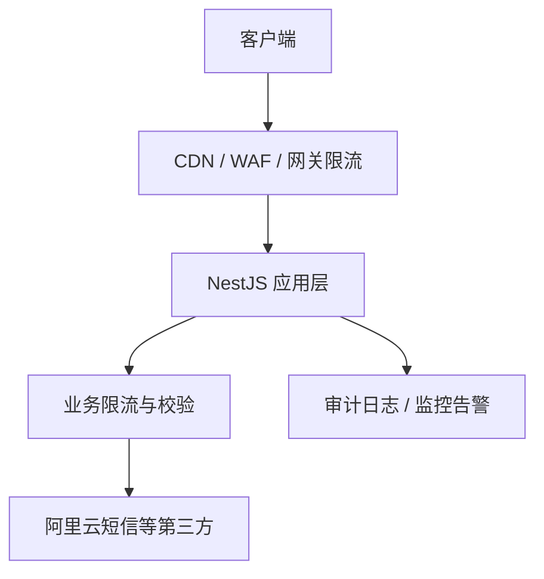

# API 接口安全防护方案

本文描述零一文档服务端对外接口的分层防护策略，重点覆盖短信验证码等高风险公开接口。

## 1. 分层架构



| 层级 | 职责 | 建议 |
|------|------|------|
| 网关 / WAF | IP 黑名单、CC 防护、全站 QPS | 阿里云 WAF、Nginx `limit_req`、Cloudflare |
| 传输层 | 防窃听、防篡改 | 全站 HTTPS，HSTS |
| 应用层 | 接口级限流、参数校验、密码 RSA 加密 | 已实现 `RateLimitService` |
| 业务层 | 短信/登录/注册等业务规则 | 手机号日限额、验证码错误次数等 |
| 数据层 | 密码 bcrypt、Token 哈希存储 | 已有 |
| 观测层 | 异常流量告警 | 日志 + 监控（待接入） |

> **多实例部署**：当前 `RateLimitService` 为进程内计数，仅对单实例有效。生产多副本需升级为 **Redis 滑动窗口** 或在网关统一限流。

---

## 2. 短信验证码接口（`POST /api/v1/c/auth/sms/send`）

### 2.1 已实现防护

| 维度 | 规则 | 环境变量 | 默认值 |
|------|------|----------|--------|
| 同号发送间隔 | 两次发送最小间隔 | `SMS_SEND_INTERVAL_SEC` | 60 秒 |
| 手机号日限额 | 每手机号每场景/天 | `SMS_PHONE_MAX_PER_DAY` | 10 次 |
| IP 小时限额 | 每 IP 每小时请求次数 | `SMS_IP_MAX_PER_HOUR` | 20 次 |
| 验证码校验失败 | 单条验证码最多错误次数 | `SMS_VERIFY_MAX_FAILS` | 5 次 |
| 注册场景 | 已注册手机号拒绝发送 | — | — |
| 阿里云侧 | `##code##` 动态码 + outId 核验 | — | — |

### 2.2 建议后续增强

1. **图形验证码 / 行为验证**：发送短信前要求完成滑块或 Turnstile，防脚本批量刷接口。
2. **Redis 限流**：替换内存 Map，支持多实例与持久化计数。
3. **短信发送审计表**：记录 phone、ip、scene、结果，便于溯源与对账。
4. **异常告警**：单 IP 1 小时内触发限流超过 N 次 → 钉钉/邮件告警。
5. **网关层**：对 `/api/v1/c/auth/sms/*` 单独配置更严格的 QPS（如 5 req/s/IP）。

### 2.3 错误码

- `120009`：发送过于频繁 / 日限额
- `120008`：验证码错误或次数过多
- HTTP `429`：可在网关或后续中间件统一返回

---

## 3. 登录 / 注册接口

### 3.1 已实现

| 能力 | 说明 |
|------|------|
| 密码 RSA 传输 | `GET /password-public-key` + 客户端加密 |
| 登录 IP 限流 | `LOGIN_IP_MAX_PER_HOUR`，默认 60 次/小时 |
| 登录账号限流 | `LOGIN_ACCOUNT_MAX_PER_HOUR`，默认 30 次/小时 |
| 账号锁定 | 连续密码错误锁定（`auth.max_login_attempts`） |
| 注册短信验证 | 须先完成短信验证 + `verificationToken` |

### 3.2 建议后续

- 注册接口增加 IP 日限额
- 管理端登录同样接入 IP 限流
- 可选：异地登录提醒、设备指纹

---

## 4. 其他公开接口

| 接口 | 现有防护 | 建议 |
|------|----------|------|
| `POST /api/v1/c/demo-requests` | IP 10 分钟 5 次（DB 计数） | 保持，可迁移至 Redis |
| `POST /api/v1/c/auth/refresh` | JWT 校验 | 增加 refreshToken 绑定 IP 可选 |
| 文件上传 | 50MB 限制 | 类型白名单 + 病毒扫描（生产） |

---

## 5. 运维配置清单

```env
# 短信
SMS_SEND_INTERVAL_SEC=60
SMS_PHONE_MAX_PER_DAY=10
SMS_IP_MAX_PER_HOUR=20
SMS_VERIFY_MAX_FAILS=5

# 登录
LOGIN_IP_MAX_PER_HOUR=60
LOGIN_ACCOUNT_MAX_PER_HOUR=30

# 密码传输加密（生产必配固定密钥）
AUTH_RSA_PRIVATE_KEY_B64=
```

---

## 6. 实施优先级

| 优先级 | 项 | 状态 |
|--------|-----|------|
| P0 | 短信多维限流 | ✅ 已实现 |
| P0 | 登录 IP/账号限流 | ✅ 已实现 |
| P0 | 密码 RSA 传输 | ✅ 已实现 |
| P1 | Redis 分布式限流 | 待做 |
| P1 | 短信前图形验证码 | 待做 |
| P2 | WAF / 网关 QPS | 部署侧配置 |
| P2 | 安全审计与告警 | 待做 |
